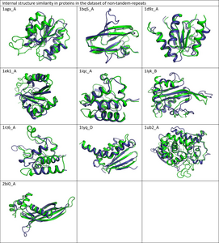
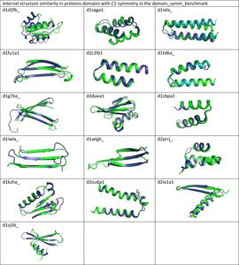

## Internal_structure_similarity_benchmark

### [RepeatsDB](https://github.com/Claualvarez/Internal_structure_similarity_benchmark/blob/master/RepeatsDB/RepeatsDB_reference_units.tsv)

### [MALIDUP](https://github.com/Claualvarez/Internal_structure_similarity_benchmark/blob/master/MALIDUP_set/MALIDUP_reference_units.tsv)

### The Database of no-repeats
We constructed a database of proteins without internal sequence and structure similarity from a subset of the PDB composed of 28337 non-redundant chains, as determined by BLASTClust at 30% sequence identity.
We applied three sequential filters:

1) structural symmetry filter: SymD [1] Z-score < 4;
2) conserved internal sequence similarity filter: InterPro [2] sequence signatures; and
3) sequence and structure evaluation using FiRES, HHrepID [3], lalign [4], RADAR [5], CE-symm [6], ReUPred [7] and Swelfe [8] with default parameter.

### Other benchmark databases 

The Dataset-non-TR (https://doi.org/10.1016/j.febslet.2015.08.025) contains duplicated domains.

Some structures considered Asymmetric in the Internal symmetry dataset (https://doi.org/10.1371/journal.pcbi.1006842) have internal structure similarity.

## References

1. Jha A, Flurchick KM, Bikdash M, Kc DB. Parallel-SymD : A Parallel Approach to Detect Internal Symmetry in Protein Domains. 2016;2016.
2. Mitchell AL, Attwood TK, Babbitt PC, et al. InterPro in 2019 : improving coverage , classification and access to protein sequence annotations. Nucleic Acids Res.
3. Biegert A, Söding J. De novo identification of highly diverged protein repeats by probabilistic consistency. Bioinformatics. 2008;24(6):807-814. doi:10.1093/bioinformatics/btn039.
4. Pearson WR, Lipmant DJ. Improved tools for biological sequence comparison. Proc Natl Acad Sci USA. 1988;85(April):2444-2448.
5. Heger A, Holm L. Rapid automatic detection and alignment of repeats in protein sequences. Proteins Struct Funct Genet. 2000;41(2):224-237.
6. Bliven SE, Lafita A, Rose PW, Capitani G, Prlić A, Bourne PE. Analyzing the symmetrical arrangement of structural repeats in proteins with CE-Symm. PLOS Comput Biol. 2019;15(4):e1006842. doi:10.1371/journal.pcbi.1006842.
7. Hirsh L, Piovesan D, Paladin L, Tosatto SCE. Identification of repetitive units in protein structures with ReUPred. Amino Acids. 2016;48(6):1391-1400. doi:10.1007/s00726-016-2187-2.
8. Abraham A, Rocha EPC, Pothier J. Swelfe : a detector of internal repeats in sequences and structures. Bioinformatics. 2008;24(13):1536-1537. doi:10.1093/bioinformatics/btn234.
